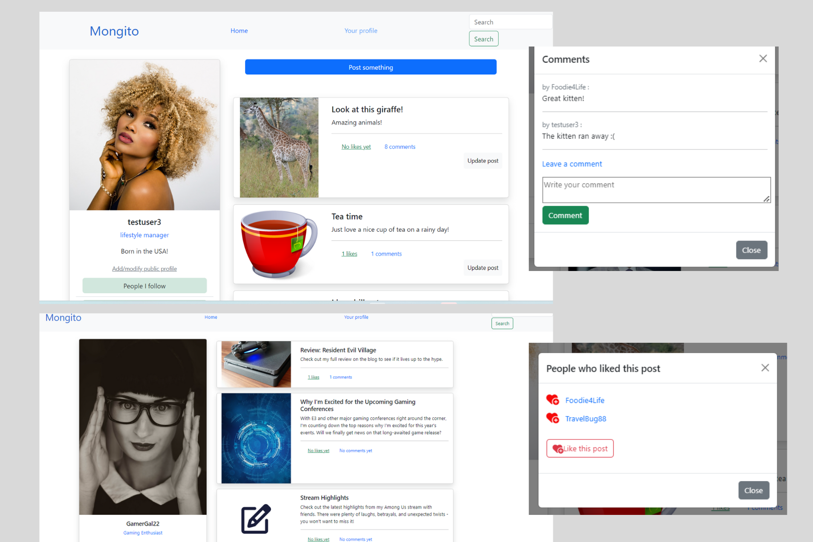

# Backend with MongoDB for a social media platform

## Description

Course project at [The Bridge](https://www.thebridge.tech) to create a functional backend for a social media platform using **Node.js - Express.js - MongoDB with Mongo Atlas - Mongoose** with a number of other tools and dependencies.

The project features REST APIS with authentication through tokens, password encrypting, email confirmation for registering users, possibility to post image files together with text data and error handling middlewares.

The database itself consists of 3 collections - Users, posts and comments.

## 🎯 Obligatory and optional tasks 

The obligatory requirements were as follows:

- [x] CRUD endpoints for **Users**, **Posts**, **Comments**
- [x] User registration and password encryption with **Bcrypt**
- [x] Validation upon registration and errors handled through middleware  
- [x] Login and other endpoints with **JSON Web tokens** 
- [x] Searching through parameters and queries
- [x] Middleware to allow only the author of the post to update or eliminate a post
- [x] Deploying the project online (see below)

Optional:

- [x] Extra endpoints such as the possibility to follow other users
- [x] **Multer** for uploading images  
- [x] **Nodemailer** for confirming registration through confirmation email 
- [x] **Swagger** for API documentation. This has so far only been added for posts.

## 💻 Frontend

A vanilla Javascript frontend has been built for practice purposes and can be found in the following Github repository:

[Project Social media frontend](https://github.com/kbastamow/Project-SocialMedia-Frontend)

## Deployment

Due to some unforeseen challenges, the project deployment had to be done using a forked repository [here](https://github.com/pacool1234/Project-SocialMedia-Backend-MongoDB). The nearly identical project was hosted on **Vercel** at the time of submitting the project.

## ▶️  How to use the project

### 📜 Dependencies required

* express
* mongoose
* jsonwebtoken
* bcryptjs
* nodemailer
* multer
* dotenv
* swagger
* cors (for frontend)

### 🛠️ Installation

Node.js needs to be installed.

Any user would need to provide database, connection locally or through a hosting service and password information as exemplified in .example.env.

## 🌐 Other tech

* [MongoDB Atlas](https://www.mongodb.com) for database hosting
* [Vercel](https://vercel.com) for deployment (see deployment notes)
* [Pixabay](https://pixabay.com) - photos for test file upload and for frontend.

## ©️ Authors

* [kbastamow](https://github.com/kbastamow)
* [pacool](https://github.com/pacool1234)

